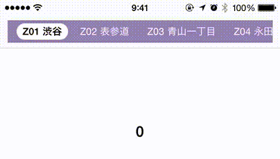

# USGScrollingTabBar

 

**USGScrollingTabBar** is a scrollable tab bar component for iOS. This project is written in Swift. [Old version (Objective-C) is here](https://github.com/usagimaru/USGScrollingTabBar).

It is scrolling by synchronized with another UIScrollView. Then the selected tab will be adjusted at the center position. The tab bar can also be scrolled independently. Tab widths are adjusted dynamically to the content of cell.

The following items can be customizable:

- Tab bar background color
- Left and right margins of the tab bar
- Tab spacing
- Inner margins of tab
- The Focus view (Auto Sinzing Layout)
- Can set NSAttributedString to each tab states, normal, highlighted, and selected


# Usage

Install custom UIView on Interface Builder or initialize programmatically.

```swift
var scrollingTabBar: USGScrollingTabBar(frame: CGRectMake(0,0,100,40)
view.addSubView:scrollingTabBar
```

## Create Tab Items

To use, you need `USGScrollingTabItem` items. This class has properties NSAttributedString titles. So you should set NSAttributedString strings each 3 states, normal, highlighted and selected.

```swift
let font = UIFont.systemFontOfSize(13) // Font
let color = UIColor.whiteColor() // Color
let paragraph = NSMutableParagraphStyle() // Paragraph Style

// Initialize NSAttributedString
let string = USGScrollingTabItem.normalAttributedString(str,
                                                        font: font,
                                                        color: color,
                                                        paragraphStyle: paragraph)

// Initialize tab item
let tabItem = USGScrollingTabItem()
// Set the string
tabItem.normalString = string
```

Reload `USGScrollingTabBar` with tab items.

```swift
var tabItems = [USGScrollingTabItem]() // Tab Item Array
...

// Set the page width. Usually it is same as another UIScrollVeiw's width.
scrollingTabBar.pageWidth = view.width
// Reload
scrollingTabBar.reloadTabs(tabItems)
```

## How to Synchronize Pager and Tab Bar ?

Use `UIScrollViewDelegate` methods like here:

```swift
func scrollViewDidScroll(scrollView: UIScrollView) {
	if scrollView == pager {
		scrollingTabBar.enabled = !scrollView.tracking
		
		// Synchronize scroll offset during tracking
		if (scrollView.tracking || scrollView.decelerating) {
			scrollingTabBar.scrollToOffset(scrollView.contentOffset.x)
		}
	}
}

func scrollViewWillBeginDragging(scrollView: UIScrollView) {
	if scrollView == pager {
		// Stop deceleration effect
		scrollingTabBar.stopScrollDeceleration()
		scrollingTabBar.enabled = false
	}
}

func scrollViewDidEndDragging(scrollView: UIScrollView, willDecelerate decelerate: Bool) {
	if scrollView == pager {
		scrollingTabBar.enabled = true
	}
}
```

## USGScrollingTabBarDelegate

You can responds to tab selection event. This method is defined by `USGScrollingTabBarDelegate`.

```swift
func tabBarDidSelectTabAtIndex(tabBar: USGScrollingTabBar, index: Int) {
	pager.setContentOffset(CGPointMake(pager.frame.size.width * CGFloat(index), pager.contentOffset.y), animated: true)
}
```

# License

This project is under the MIT license. See [LICENSE](LICENSE) for details.
